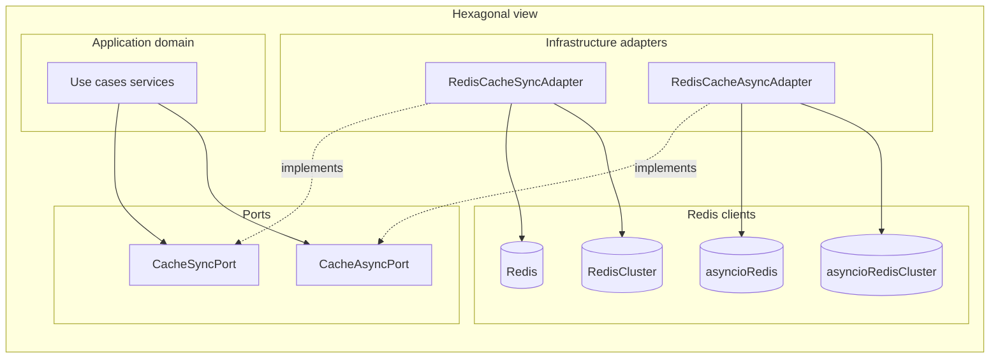

# Redis cache: ports & adapters (uv, sync + async, cluster, JSON, encryption, TTL, counters)

## Context

Target stack: **Python**, **`uv`**, **`redis`** (redis-py with optional `hiredis`) supporting **standalone** (`Redis`, `redis.asyncio.Redis`) and **Redis Cluster** (`redis.cluster.RedisCluster`, `redis.asyncio.cluster.RedisCluster`), **`cryptography`** (Fernet), **`pydantic` v2**. The package is structured for **Ports and Adapters (hexagonal architecture)**: **application/domain depends on Ports**; **Redis adapters** live in infrastructure and implement those Ports.

## Ports and adapters (hexagonal)

- **Port (driving side boundary)**: a **`typing.Protocol`** — e.g. **`CacheSyncPort`** and **`CacheAsyncPort`** — declared in a **`ports/`** package. It exposes **only** cache operations the application needs (`set_json`, `get_model`, `incr`, …). **No `redis` imports** in port modules; types use stdlib / Pydantic only as needed for signatures (`JsonValue`, `BaseModel`).
- **Adapter (infrastructure)**: **Redis** implementations live under **`adapters/redis/`** — e.g. **`RedisCacheSyncAdapter`**, **`RedisCacheAsyncAdapter`** — implementing the ports. They depend on **redis-py** clients (**`Redis` / `RedisCluster`**, async equivalents), **Fernet**, and **Pydantic** codecs. **Serialization + encryption are adapter concerns** unless you later split a dedicated “encrypting decorator” adapter.
- **Composition root**: application bootstrap (FastAPI lifespan, CLI `main`, worker entrypoint) constructs redis-py clients and **`RedisCache*Adapter(...)`**, then injects **`CacheSyncPort` / `CacheAsyncPort`** into services/use-cases. Domain code references **only** the port types.
- **Testing**: unit tests for domain logic use a **fake / stub port** (in-memory dict adapter in `tests/` or `adapters/memory/`) or **`fakeredis`** behind the Redis adapter; port-level tests never require a real Redis.
- **Optional naming aliases**: re-export **`SyncCachePort = CacheSyncPort`** in `__init__.py` if you prefer shorter names in DI containers.

## Design principles

- **Dependency injection via ports**: callers (services, use cases) depend on **`CacheSyncPort` / `CacheAsyncPort`**, never on Redis adapter classes. Adapters accept an injected redis-py **client** (`Redis | RedisCluster`, async equivalents) plus **`fernet_key`** / **`key_prefix`** as constructor args.
- **Redis adapter backends**: each of **`RedisCacheSyncAdapter`** / **`RedisCacheAsyncAdapter`** works with **either** standalone **or** cluster clients (four combinations total). **Same method names** on sync vs async ports/adapters so swapping implementations stays trivial.
- **Encryption boundary**: ports expose **`set*` / `get*`** with domain-friendly types; **adapters** perform **Pydantic JSON bytes → Fernet → Redis** and reverse on read (**decrypt → `validate_json` / `model_validate_json`**). Fail closed with **`DecryptionError`** / **`SerializationError`** (or wrapped **`ValidationError`**) at the adapter boundary.
- **JSON via Pydantic**: structured cache entries are **UTF-8 JSON bytes** produced and parsed with **Pydantic v2** so encoding stays strict and validation is centralized. Use **`TypeAdapter(JsonValue)`** (or Pydantic’s `JsonValue` type) for **`set_json` / `get_json`**: validate Python values on write (`dump_json` / `validate_python` path), **`validate_json`** on read after decrypt—reject invalid trees or malformed JSON with **`ValidationError`** mapped or wrapped as **`SerializationError`** where that fits your public API.
- **Typed models**: **`set_model` / `get_as_model`** are **first-class** APIs backed by **`BaseModel.model_dump_json()`** / **`model_validate_json()`** (or `TypeAdapter(T)` with the same JSON bytes) so DI callers hydrate directly to domain models without a separate optional install.
- **TTL**: expose `ttl_seconds` (or `expiry` / `ttl`) on `set`/`set_many`; map to `SET key value EX ttl` / `SETEX` / pipeline equivalents.
- **Atomic counters**: Redis **`INCR`/`DECR`/`INCRBY`** are atomic only on **Redis string integers**. Encrypting those values would break native atomic ops. Plan therefore splits concerns:
  - **`set` / `get`** (if retained): encrypted payloads whose plaintext is still **Pydantic-produced JSON** unless you explicitly keep a separate opaque `bytes` escape hatch for non-JSON blobs.
  - **`incr` / `decr` / `incrby`**: **plaintext integers** stored at keys you treat as counter namespaces (document this in docstrings). Optionally prefix counter keys (e.g. `counter:`) to avoid accidental collision with encrypted keys.

If you later need **encrypted counters**, that implies **non-native** semantics (e.g. Lua + decrypt/increment/re-encrypt with locking)—out of scope for the first iteration unless you explicitly want it.

## uv project layout

- Initialize with `uv init` (package layout if you want importable module: `src/async_redis_client/` or flat `cache/`—prefer **`src` layout** for libraries).
- **`pyproject.toml`**: project metadata, Python version (3.11+ recommended), dependencies:
  - `redis[hiredis]` (optional `hiredis` for speed)
  - `cryptography`
  - `pydantic` (v2; JSON + `BaseModel` hydration)
  - dev: `pytest`, `pytest-asyncio`, `fakeredis` (sync + asyncio testing without Docker)

Commands (when you approve execution):

```bash
uv init --package src/async_redis_client   # or equivalent layout you prefer
uv add redis cryptography pydantic
uv add --dev pytest pytest-asyncio fakeredis
```

## JSON storage and hydration

- **On the wire inside Redis**: ciphertext Fernet token; **plaintext immediately before encrypt** is UTF-8 JSON (no Redis JSON document type required—one code path everywhere redis-py works).
- **`set_json` / `get_json`**: dict/list/scalar trees typed as **`JsonValue`**; implement with **`TypeAdapter(JsonValue)`** so the same validation applies on read and write. Prefer Pydantic’s JSON routines (**`dump_json`**, **`validate_json`**) so **`NaN`/`Infinity`** and other non-JSON values are rejected consistently.
- **`set_model` / `get_as_model`**: use **`BaseModel.model_dump_json()`** → encrypt → Redis on write; decrypt → **`model_validate_json(bytes)`** on read. For generics or non-`BaseModel` types, use **`TypeAdapter(T)`** with the same decrypt→`validate_json` pattern.

## Module split (concise)

Suggested layout under **`src/async_redis_client/`**:

| Piece | Responsibility |
|--------|----------------|
| [`src/async_redis_client/ports/cache_port.py`](../src/async_redis_client/ports/cache_port.py) | **`CacheSyncPort`**, **`CacheAsyncPort`** (`typing.Protocol`): `get`, `set`, `set_json`, `get_json`, `set_model`, `get_as_model`, `delete`, `exists`, `incr`, `decr`, `incrby`, optional `set_many`/`get_many` — **no redis imports** |
| [`src/async_redis_client/errors.py`](../src/async_redis_client/errors.py) | `CacheError`, `DecryptionError`, `SerializationError` (shared; safe for domain to catch stable subsets if desired) |
| [`src/async_redis_client/serialization.py`](../src/async_redis_client/serialization.py) | Pydantic **`TypeAdapter`** helpers (JSON `bytes` ↔ `JsonValue`; model encode/decode) — used **by adapters**, not required by port callers |
| [`src/async_redis_client/crypto.py`](../src/async_redis_client/crypto.py) | Fernet **`encrypt_bytes` / `decrypt_bytes`** — adapter infrastructure |
| [`src/async_redis_client/adapters/redis/sync.py`](../src/async_redis_client/adapters/redis/sync.py) | **`RedisCacheSyncAdapter`**: implements **`CacheSyncPort`**, **`Redis | RedisCluster`** |
| [`src/async_redis_client/adapters/redis/async_adapter.py`](../src/async_redis_client/adapters/redis/async_adapter.py) | **`RedisCacheAsyncAdapter`**: implements **`CacheAsyncPort`**, **`redis.asyncio.Redis | redis.asyncio.cluster.RedisCluster`** |
| [`src/async_redis_client/hydration.py`](../src/async_redis_client/hydration.py) | Optional thin split from `serialization.py` if needed |

**Driving adapters** (REST controllers, CLI) live in *your* application repo; this library provides the **cache port** contract + **Redis-driven** side adapter only.

Keep **connection management** explicit:

- **Standalone**: prefer **`Redis.from_url`** + **`ConnectionPool`** constructed once and injected.
- **Cluster**: construct **`RedisCluster`** / **`redis.asyncio.cluster.RedisCluster`** once (e.g. **`RedisCluster.from_url`**, or **`startup_nodes`** + SSL/TLS kwargs as needed) and inject into the **adapter**. Adapters do **not** own cluster topology beyond documenting kwargs (password, TLS, `skip_full_coverage_check` only if justified).
- Optional factories on **adapters**: **`RedisCacheSyncAdapter.from_standalone_url(...)`** vs **`...from_cluster_url(...)`** (or **`cluster=`**) so composition roots wire topology without leaking redis-py into domain code.
- Support **`async with`** / **`with`** for closing clients if an **adapter** instance owns the underlying client.

### Redis Cluster caveats (document in docstrings)

- Single-key commands used by v1 (**`GET`/`SET`/`DEL`/`EXISTS`/`INCR*`**) are cluster-safe when issued through redis-py’s cluster client (handles **MOVED/ASK**).
- Any future **multi-key** or **transaction** features must respect **hash-slot** rules; prefer **hash tags** in **`key_prefix`** or key naming conventions for related keys that must participate in one logical batch.

## Port sketch (logical API)



**Encrypted operations** (serialize → encrypt):

- `get(key) -> T | None` — generic blob path (implementation may delegate to JSON codec by default).
- `set(key, value, ttl_seconds: int | None = None) -> None`
- **`set_json(key, value: JsonValue, ttl_seconds: int | None = None) -> None`** — validate/dump via **`TypeAdapter(JsonValue)`** then encrypt.
- **`get_json(key) -> JsonValue | None`** — decrypt → **`validate_json`**; invalid payloads raise **`SerializationError`** or wrapped **`ValidationError`** (pick one public convention).
- **`set_model(key, model: BaseModel, ttl_seconds: int | None = None) -> None`** / **`get_as_model(key, model_type: type[T]) -> T | None`** — **required** surface; uses **`model_dump_json()`** / **`model_validate_json()`** (or `TypeAdapter`) after decrypt.
- `delete(key) -> int` (deleted count)
- `exists(key) -> bool`

Implementation note: **`set_json`/`get_json` and `set`/`get` can share one code path** (JSON bytes + encrypt) so callers choose clarity (`set_json`) vs generic cache (`set`).

**Atomic integer operations** (no encryption; Redis-native):

- `incr(key, amount: int = 1) -> int`
- `decr(key, amount: int = 1) -> int` (or implement via negative `incrby`)

Optional extensions (nice for DI consumers): `set_many`/`get_many` via pipeline — **on Cluster, multi-key operations must target keys in the same hash slot**; document **hash tags** (e.g. `{tenant}:a`, `{tenant}:b`) or restrict `*_many` helpers to single-slot batches and raise a clear error when violated.

## Encryption and keys

- **Fernet** keys: 32 url-safe base64-encoded bytes (`cryptography.fernet.Fernet.generate_key()`).
- Load key from **`CACHE_FERNET_KEY`** env or constructor injection **`fernet_key: bytes`** (constructor wins for tests).
- Namespace Redis keys with an optional **`key_prefix`** (`str`) passed into cache constructor so multiple apps share one Redis safely.

## Testing strategy

- Unit tests: **adapter tests** with **`fakeredis`** / optional cluster integration; **domain tests** against a **stub port** or in-memory adapter so use cases never import `redis`.

## Deliverables checklist

- `pyproject.toml` + lockfile via `uv lock`
- **`CacheSyncPort` / `CacheAsyncPort`** + **`RedisCacheSyncAdapter` / `RedisCacheAsyncAdapter`**
- Documented **hexagonal layering** (domain → port only), **standalone vs cluster** wiring in composition root, **hash-slot** rules for multi-key helpers, and **encrypted JSON vs counter** semantics

## Out of scope (unless you ask)

- Key rotation / KMS integration (AWS KMS, Vault)—plan assumes static Fernet key v1.
- Transparent compression before encrypt (easy add-on: zlib layer before Fernet).
- **Redis Sentinel** topology as a first-class factory (cluster is in scope; Sentinel wiring can follow the same inject-a-client pattern later).
